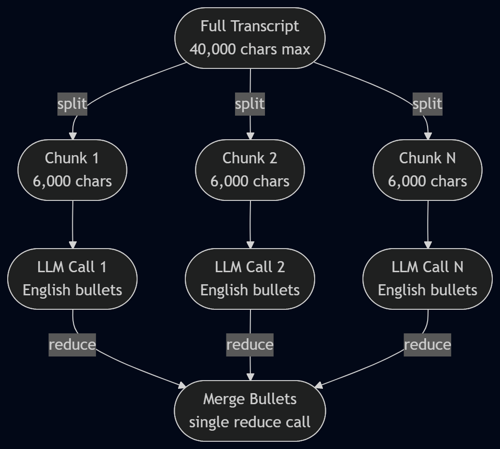
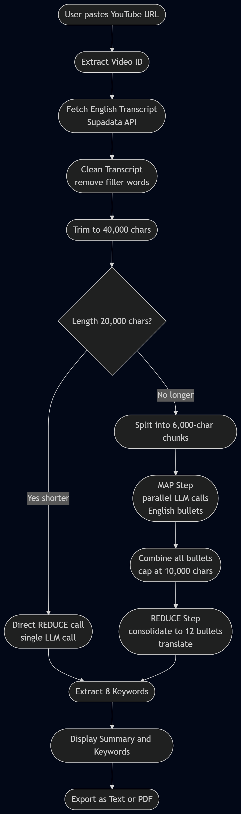
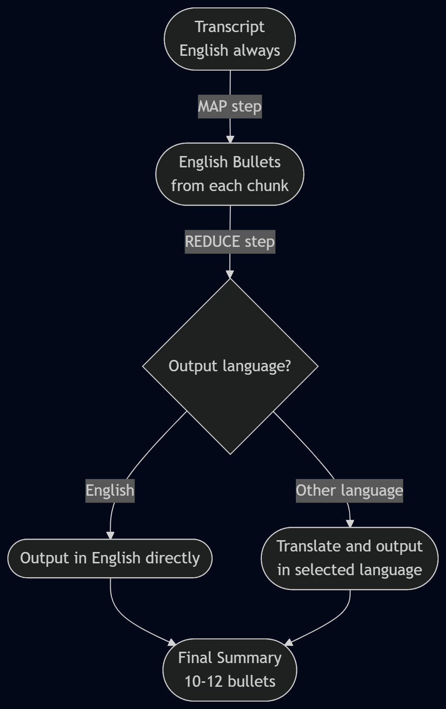
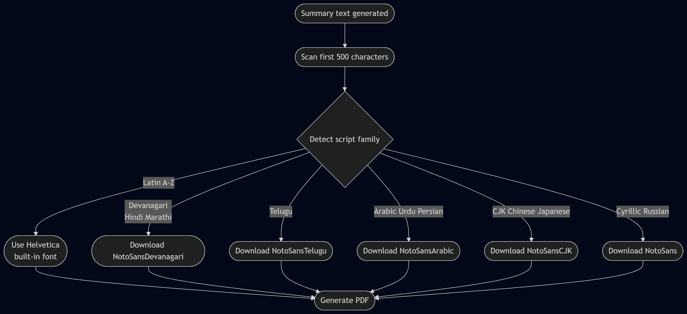
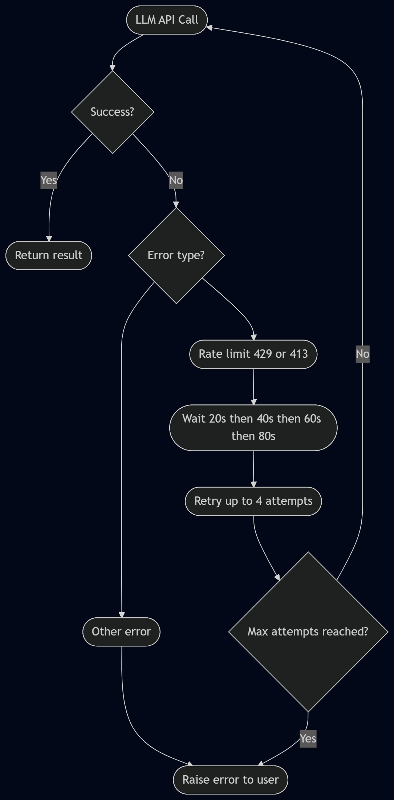

# 🎥 YouTube Video Summarizer

**An AI-powered YouTube video summarizer built with Streamlit and Groq LLM.**  
Paste any YouTube link → get a clean 10–12 bullet summary in seconds.  
Supports 30+ output languages with Unicode-safe PDF export.

🔗 **Live App:** [youtube-summarizer-bb5jnp9eburzbwmafmpmoh.streamlit.app](https://youtube-summarizer-bb5jnp9eburzbwmafmpmoh.streamlit.app/)

---

## What It Does

Have you ever wanted to get the key points of a 2-hour YouTube video in under 2 minutes?

This app does exactly that.

- Paste **any YouTube URL** that has English captions
- Select your **output language** (30+ supported)
- Click **Generate Summary**
- Get a clean **10–12 bullet point summary** of the entire video
- Download it as **PDF or plain text**

No sign-up. No setup. Just paste and summarize.

---

## Live Demo

🌐 **[Open the App](https://youtube-summarizer-bb5jnp9eburzbwmafmpmoh.streamlit.app/)**

---

## Features

| Feature | Details |
|---|---|
| ✅ English transcript support | Works with any YouTube video that has English captions |
| 🌐 30+ output languages | Hindi, Telugu, Tamil, Spanish, French, Arabic, Japanese and more |
| 🔑 Keyword extraction | 8 key topics extracted automatically |
| 📄 PDF export | Unicode-safe — supports all scripts including Telugu, Arabic, CJK |
| 📋 Text export | Plain text download |
| ⚡ Map–Reduce pipeline | Handles videos of any length (tested up to 2+ hours) |
| 🎨 Clean UI | Glassmorphism design with custom CSS |
| 🔁 Retry logic | Auto-handles API rate limits gracefully |

---

## Tech Stack

| Layer | Technology |
|---|---|
| UI | Streamlit |
| LLM | Groq — `llama-3.1-8b-instant` |
| Transcript | Supadata YouTube Transcript API |
| PDF generation | `fpdf2` + Google Noto Fonts |
| Text splitting | LangChain `RecursiveCharacterTextSplitter` |
| Summarization | Custom Map–Reduce pipeline |

---

## Architecture

### Core Design Decision — English Transcript Only

The app **always fetches the transcript in English**, regardless of the output language selected.

**Why?**
- Non-Latin scripts (Telugu, Hindi, Arabic) tokenize at **~1 char = 1 token**
- English tokenizes at **~4 chars = 1 token**
- Using English transcripts keeps every API call safely within the **6,000 TPM limit**
- Translation happens only **once** at the final reduce step — not per chunk

---

### End-to-End Pipeline

| Step | What happens |
|---|---|
| 1 | User pastes YouTube URL |
| 2 | App extracts video ID (supports normal, shorts, youtu.be links) |
| 3 | Fetches English transcript via Supadata API |
| 4 | Cleans transcript — removes filler words (um, uh, you know…) |
| 5 | Trims to 40,000 characters |
| 6 | Splits into 6,000 character chunks (if video is long) |
| 7 | MAP step — extracts English bullets from each chunk in parallel |
| 8 | REDUCE step — consolidates into 10–12 unique bullets + translates |
| 9 | Extracts 8 keywords |
| 10 | Renders in UI + enables export |

---

### Map–Reduce Summarization

**Why Map–Reduce?**

Sending a full 2-hour transcript to an LLM in one shot causes token limit errors and low quality output. Instead:

**MAP step (parallel)**
- Transcript is split into 6,000-character chunks with 100-char overlap
- Each chunk is processed by the LLM simultaneously (2 workers)
- Output: concise English bullet points per chunk

**REDUCE step (single call)**
- All English bullets combined (capped at 10,000 chars)
- LLM consolidates into **up to 12 unique bullets**
- Duplicates removed, most important points kept
- Translated into selected output language in the same call

---

### Transcript to Summary Flow

---

### Translation Architecture

Translation is a **single operation** at the reduce step — not per chunk.

- MAP always outputs **English** (token-efficient, consistent)
- REDUCE translates the final 10–12 bullets in one call
- This uses ~10× fewer tokens than translating each chunk separately

---

### PDF Unicode Font Detection

The default Helvetica font only supports ASCII/Latin characters.  
For non-Latin scripts the app auto-detects the script and downloads the matching Google Noto font at runtime.

| Script | Languages | Font |
|---|---|---|
| Latin | English, Spanish, French, German | Helvetica (built-in) |
| Devanagari | Hindi, Marathi | NotoSansDevanagari |
| Telugu | Telugu | NotoSansTelugu |
| Tamil | Tamil | NotoSansTamil |
| Kannada | Kannada | NotoSansKannada |
| Malayalam | Malayalam | NotoSansMalayalam |
| Arabic | Arabic, Urdu, Persian | NotoSansArabic |
| CJK | Chinese, Japanese | NotoSansCJK |
| Cyrillic | Russian, Ukrainian | NotoSans |

---

### Rate Limit Protection

The app uses **Groq's free tier** which has strict limits:

| Limit | Value |
|---|---|
| TPM (tokens per minute) | 6,000 |
| TPD (tokens per day) | 500,000 |

Built-in protections:
- `time.sleep(12)` between every LLM call
- Exponential backoff: **20s → 40s → 60s → 80s**
- Catches `429` (rate limit) and `413` (too large) errors
- Hard size caps on every input before it reaches the LLM
- Up to **4 retry attempts** per call before failing

---

## Constants Reference

| Constant | Value | Purpose |
|---|---|---|
| `CHUNK_SIZE` | 6,000 chars | Max per MAP chunk (~1,500 tokens) |
| `CHUNK_OVERLAP` | 100 chars | Overlap between chunks |
| `SHORT_THRESHOLD` | 20,000 chars | Below this → skip MAP, direct REDUCE |
| `MAX_FINAL_CHARS` | 10,000 chars | Max bullets sent to REDUCE (~2,500 tokens) |
| `MAX_KW_CHARS` | 1,200 chars | Max text for keyword extraction |
| Transcript hard cap | 40,000 chars | Raw transcript size limit |
| Map workers | 2 | Parallel chunk processing |
| Max summary bullets | 12 | Hard cap in prompt + `parse_bullets()` |
| Keywords | 8 | Always extract exactly 8 |

---
